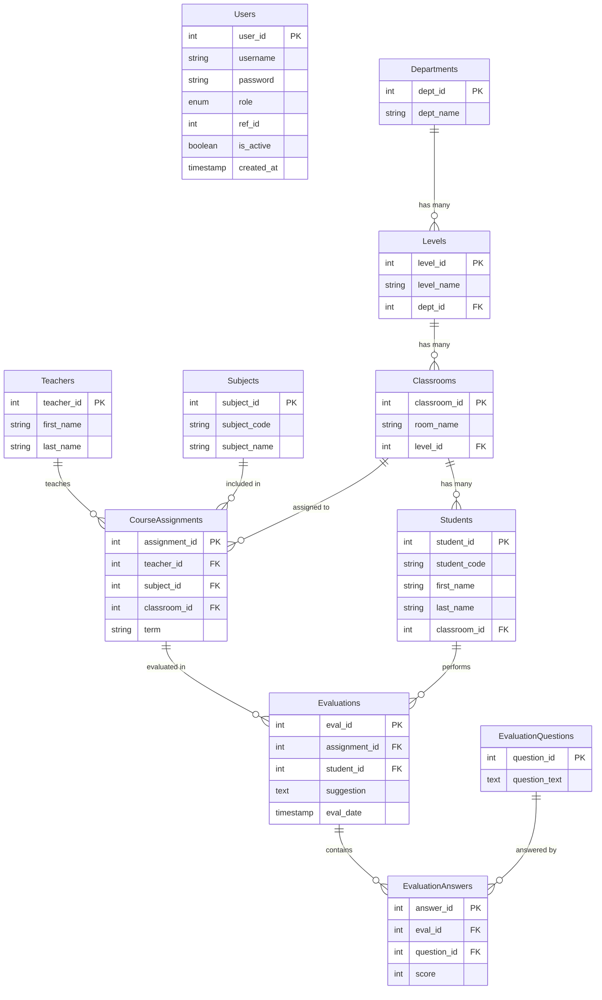

# Backend Evaluation System

## Database Schema

```mermaid
erDiagram
    Users {
        int user_id PK
        string username
        string password
        enum role
        int ref_id
        boolean is_active
        timestamp created_at
    }

    Departments {
        int dept_id PK
        string dept_name
    }

    Levels {
        int level_id PK
        string level_name
        int dept_id FK
    }

    Classrooms {
        int classroom_id PK
        string room_name
        int level_id FK
    }

    Teachers {
        int teacher_id PK
        string first_name
        string last_name
    }

    Subjects {
        int subject_id PK
        string subject_code
        string subject_name
    }

    CourseAssignments {
        int assignment_id PK
        int teacher_id FK
        int subject_id FK
        int classroom_id FK
        string term
    }

    Students {
        int student_id PK
        string student_code
        string first_name
        string last_name
        int classroom_id FK
    }

    Evaluations {
        int eval_id PK
        int assignment_id FK
        int student_id FK
        text suggestion
        timestamp eval_date
    }

    EvaluationQuestions {
        int question_id PK
        text question_text
    }

    EvaluationAnswers {
        int answer_id PK
        int eval_id FK
        int question_id FK
        int score
    }

    Departments ||--o{ Levels : "has many"
    Levels ||--o{ Classrooms : "has many"
    Classrooms ||--o{ Students : "has many"
    Teachers ||--o{ CourseAssignments : "teaches"
    Subjects ||--o{ CourseAssignments : "included in"
    Classrooms ||--o{ CourseAssignments : "assigned to"
    CourseAssignments ||--o{ Evaluations : "evaluated in"
    Students ||--o{ Evaluations : "performs"
    Evaluations ||--o{ EvaluationAnswers : "contains"
    EvaluationQuestions ||--o{ EvaluationAnswers : "answered by"
```
